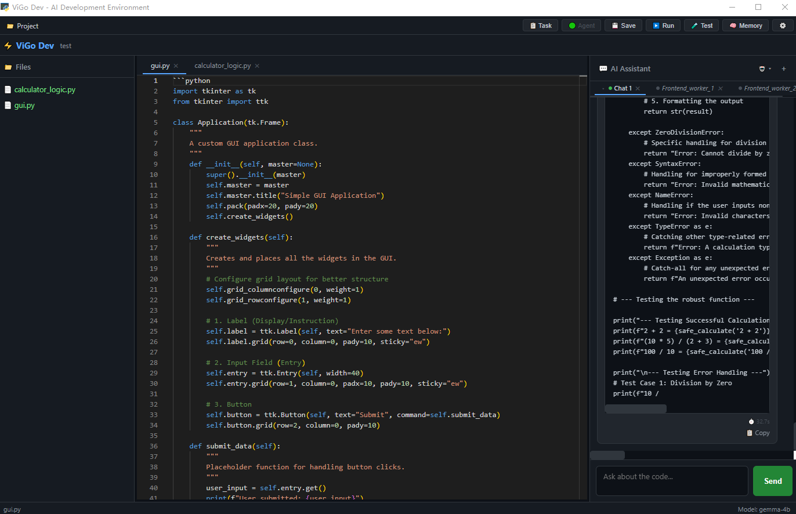
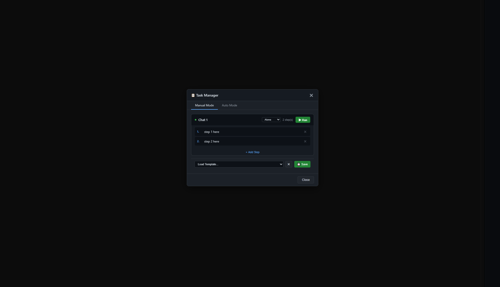
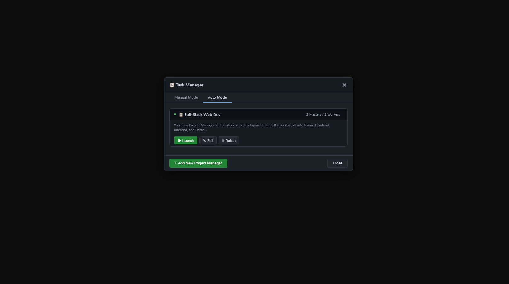
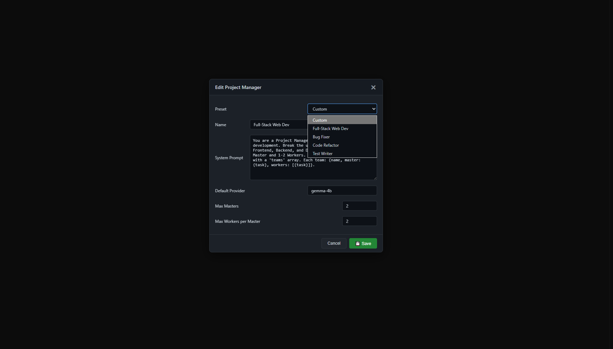
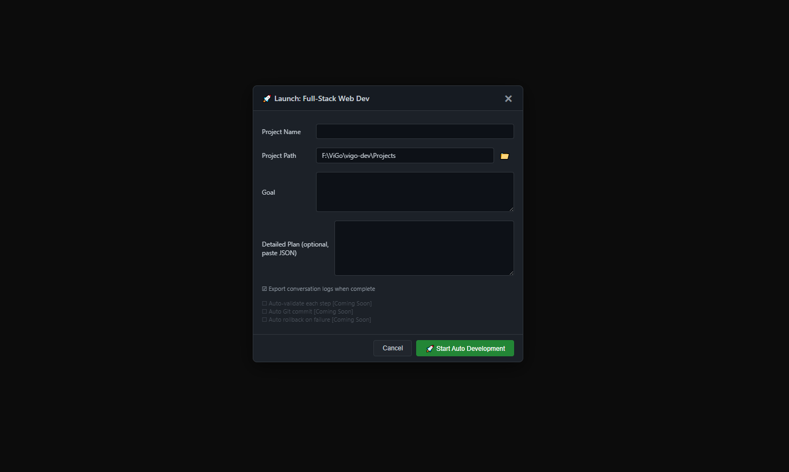

# ViGo Dev

**AI-Powered Development IDE for the ViGo Programming Language**

ViGo Dev is a native desktop IDE that combines a code editor, AI coding assistant,
multi-agent task orchestration, Git integration, and project management into one
unified environment. Built with PyWebView, Monaco Editor, and Ollama local AI.

## System Requirements

- **OS:** Windows 10 or later
- **Python:** 3.10 or higher
- **RAM:** 8 GB minimum (16 GB recommended for larger AI models)
- **Ollama:** Installed and running (for AI features)
- **Disk:** ~2 GB free (for AI models)

---

## Installation

### 1. Clone the repository

```bash
git clone https://github.com/Beck-HM/ViGo.git
cd ViGo
```

### 2. Install Python dependencies

```bash
pip install pywebview chromadb
```

### 3. Install Ollama

Download and install Ollama from [ollama.com](https://ollama.com).

### 4. Pull the recommended model

```bash
ollama pull gemma2:9b
```

You can also download models directly from the IDE's **Models** panel.

---

## Agent Mode — Semi-Automated & Fully Automated Workflows

ViGo Dev features a unique **Agent Mode** that lets you automate complex coding
tasks using AI. It comes in two flavors:

<p align="center">
  
  <br><em>Auto Agent completed project — a Python calculator with GUI, showing
  gui.py in the editor</em>
</p>

### Semi-Automated (Manual Mode)

In the Task Manager's **Manual Mode**, you define a pipeline of steps and assign
each step to a Master chat or a Worker chat. The AI executes steps in order,
passing context from one step to the next.

- **Alone Mode** — Each chat runs its own independent task chain
- **Manager Mode** — A single pipeline with assignable steps. The Master can
  delegate specific steps to Workers, and results flow back automatically

This is ideal when you want full control over the workflow but don't want to
manually type each instruction.

<p align="center">
  
  <br><em>Task Manager — Manual Mode with step configuration for each master
  chat</em>
</p>

### Fully Automated (Auto Mode)

In **Auto Mode**, you create a **Project Manager** — an AI agent with a custom
System Prompt that defines how it plans and delegates work. You give it a goal
(e.g. "Build a Python calculator with GUI"), and the Project Manager:

1. **Decomposes** the goal into structured teams and steps using its System Prompt
2. **Creates** Master and Worker chats automatically
3. **Executes** the pipeline step by step, passing context between them
4. **Monitors** progress in real-time through the Agent Monitor panel

Each Project Manager can be configured with:
- A custom System Prompt that defines its planning strategy
- Limits on the number of Masters and Workers
- A default AI model

Preset templates are included for common workflows like Full-Stack Web
Development, Bug Fixing, Code Refactoring, and Test Writing.

The Agent Monitor shows live progress of each team and step, with color-coded
status indicators (✅ done / 🔧 running / ⏳ waiting).

<p align="center">
  
  <br><em>Task Manager — Auto Mode showing a Full-Stack Web Dev Project
  Manager</em>
</p>

<p align="center">
  
  <br><em>Creating a new Project Manager with custom System Prompt, model, and
  limits</em>
</p>

<p align="center">
  
  <br><em>Launching a Project Manager — setting project name, path, and goal
  before AI decomposes the task</em>
</p>

---

## Quick Start

1. **Start Ollama** (if not already running):

```bash
ollama serve
```

2. **Launch ViGo Dev**:

```bash
cd vigo-dev
python main.py
```

3. **Open or create a project** from `Project > New Project` or `Project > Open Project`.

4. **Start coding** — use the AI assistant panel on the right, or press `F3` to
   select code and ask questions about it.

> **Note:** AI features require Ollama to be running. Without it, the editor and
> file management still work fully.


---

## Features

### Code Editor
- Monaco Editor with ViGo syntax highlighting and autocomplete
- Simultaneously supporting Python
- Multi-tab editor with drag-and-drop file opening
- F3 code selection — select any code and ask AI about it
- Diff view — compare files with their backups (Monaco Diff Editor)

### AI Assistant
- Multi-turn conversation with streaming token display
- Read, write, create, and search files directly from chat
- Tool execution status display (Thinking / Reading / Writing)
- Auto memory recall — remembers past conversations
- Per-chat model selection

### Multi-Chat & Worker System
- Multiple independent AI conversations with tab management
- Master / Worker architecture — delegate tasks to sub-chats
- Collapsible chat tabs for better organization
- Right-click rename on chat tabs

### Task Manager
- **Manual Mode:** Alone (independent) and Manager (pipeline) task modes
- **Auto Mode:** Project Manager agents that decompose goals into steps
- Pipeline execution with context passing between steps
- Task templates — save and reuse common workflows

### Auto Agent
- Create Project Managers with custom System Prompts
- AI-powered goal decomposition into multi-step pipelines
- Automatic Worker creation and parallel execution
- Real-time Agent Monitor panel

### Git Integration
- View branch, status, and changed files
- Commit, push, pull from within the IDE
- Create and switch branches

### Models Panel
- List installed Ollama models
- Download popular models with progress tracking
- Delete models

### Project Management
- Create ViGo or Python projects
- File tree with right-click context menu
- Automatic backup before AI file modifications

### Settings
- AI: Ollama host, memory mode, auto-save interval, timeout
- Editor: font size, theme, tab size, word wrap
- Customizable F3 shortcut key

---

## Keyboard Shortcuts

| Shortcut | Action |
|----------|--------|
| `Ctrl+S` | Save current file |
| `F5` | Run current `.vigo` file |
| `F3` | Enter code selection mode to ask AI |
| `Ctrl+Shift+N` (customizable) | Configure F3 shortcut in Settings |

---

## Configuration

Settings are stored in `.vigo_config.json` inside the `vigo-dev/` directory.

| Setting | Default | Description |
|---------|---------|-------------|
| `ollama_host` | `http://localhost:11434` | Ollama API endpoint |
| `memory_mode` | `auto` | Auto-inject conversation history (`auto` / `manual`) |
| `timeout` | `120` | AI request timeout in seconds |
| `theme` | `vs-dark` | Editor theme (`vs` / `vs-dark` / `hc-black`) |
| `font_size` | `13` | Editor font size |
| `f3_shortcut` | `F3` | Customizable code selection key |
---

## Beta Notice

This software is currently in **beta testing**. Features are functional but may
contain bugs or rough edges. If you encounter any issues, please report them at:

[https://github.com/Beck-HM/ViGo/issues](https://github.com/Beck-HM/ViGo/issues)

Your feedback helps make ViGo Dev better.

---

## Known Limitations

- **Drag & drop files** from external file manager is not supported due to
  PyWebView limitations. Use `File > Open` or the file tree.
- **Bytecode VM** does not support class definitions or the pipe operator
  (`|>`). Use the tree-walk interpreter or Python transpiler for full features.
- **Parallel AI execution** is not yet supported. Multi-step pipelines run
  sequentially.
- **Ollama required** for all AI features. Cloud API support is planned for a
  future release.
  
---


## Links

- **GitHub:** [https://github.com/Beck-HM/ViGo](https://github.com/Beck-HM/ViGo)
- **Issues:** [https://github.com/Beck-HM/ViGo/issues](https://github.com/Beck-HM/ViGo/issues)
```